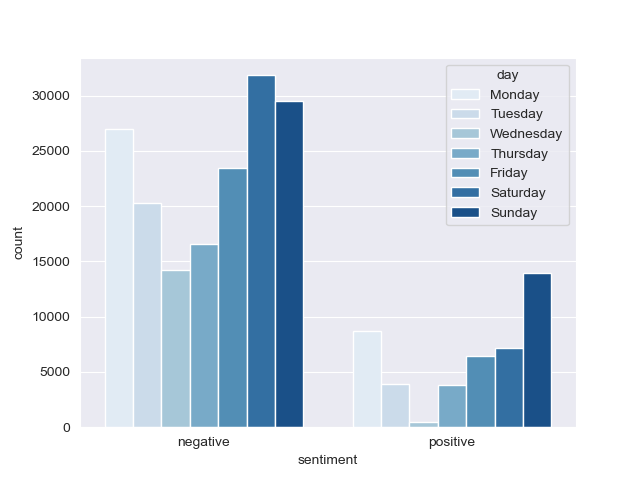
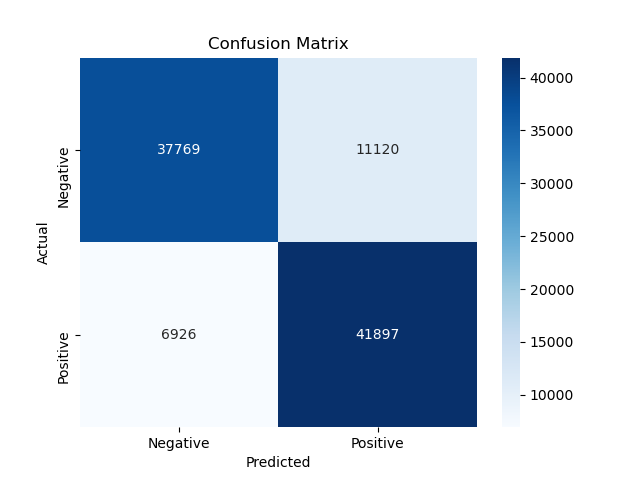

# Sentiment Analysis: Real-time Insight into Public Sentiment on Social Media Platforms

We need to in real time, accurately label customer perception on our product or platform. Sentiment Analysis allows us, given a topic, to measure how favorable attitudes are towards a certain product.

## Business Problem and Understanding

Challenge: Lack of Real-time Insight into Public Sentiment on Social Media Platforms

Customer Perception: Understanding how our target audience feels about our brand, products, or events is crucial for informed decision-making and strategic planning.

Emerging Trends: Without real-time sentiment analysis, we risk missing out on emerging trends and consumer preferences that could shape our future strategies.

Reputation Management: Proactively managing our online reputation becomes a challenge when we don't have timely insights into public sentiment.

Marketing Strategy: Crafting effective marketing strategies requires a deep understanding of the current sentiment landscape to ensure our messaging aligns with audience expectations.

Solution: Real time tweet sentiment analysis

## Data Sources

The data is sourced from Kaggle. 

It is a dataset of tweets, containing approximately 1,600,000 tweets. 

The dataset is from April and May of 2009.

## Tweet Trends

Some interesting insights I found concerning tweeting trends:

* Tweets are more negative in general.
* Negative tweets hit the roof on Saturday.
* Positive tweets are at the highest on Sundays
* On Wednesday people are DONE with positivity

## Model Flow 

During the modeling process, I built many models, here are a few of them and their stats:

> The metric used here is accuracy.

* MultinomialNB = 77%
* ComplementNB = 77%
* BernoulliNB = 78%
* Random Forests Classifier = 71% 
* XGBoost = 73%
* Logistic Regression = 82%

As you can probably tell, the model with the highest accuracy is the Logistic Regression Model. I did have to run a few grid searches to find the correct hyperparameters, see in the modeling notebook linked below.

## Recommendations

Use this model to:

* Detect emerging trends

* Analyze public opinion towards a brand/product

* Understand customer perception

* Inform marketing strategies
